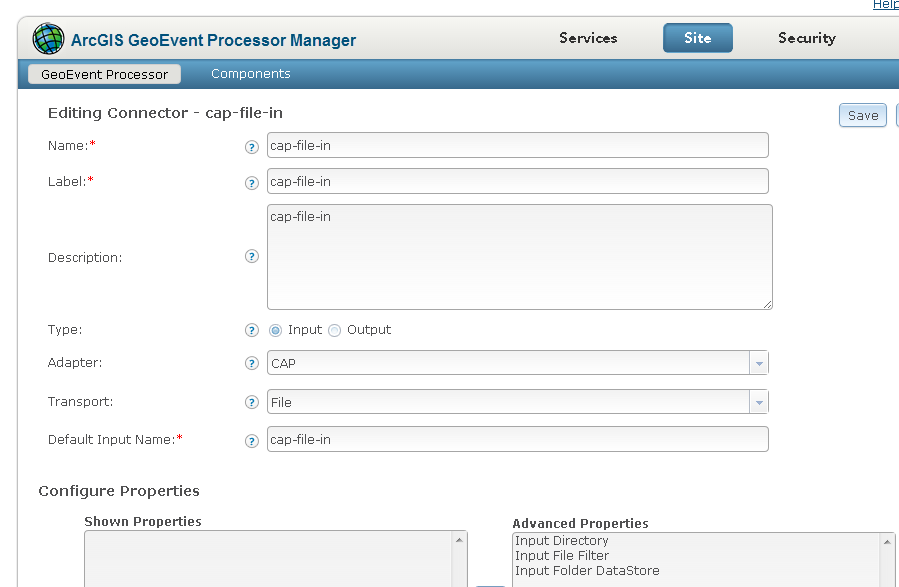
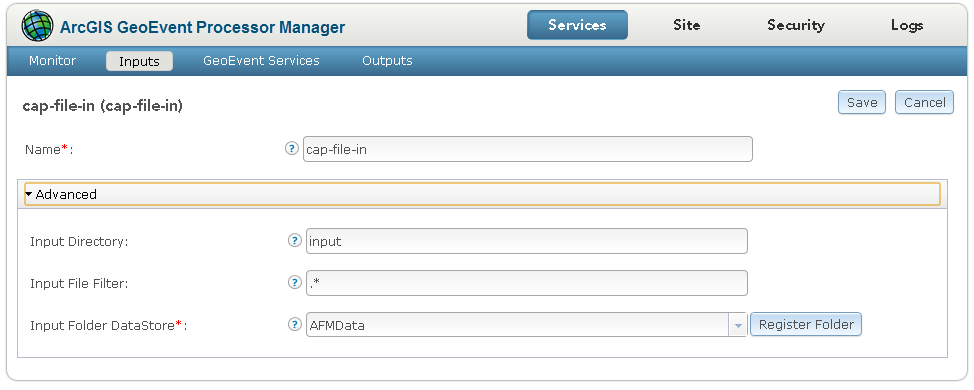
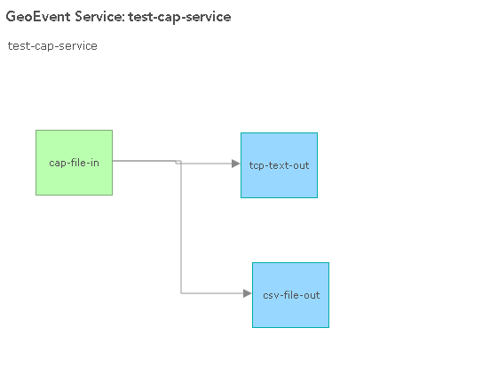
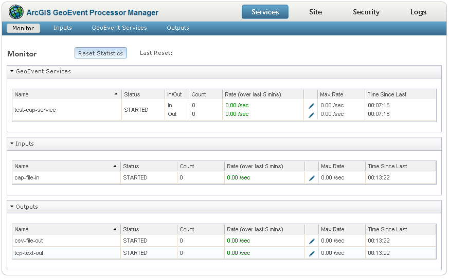

# CAP-Adapter

The CAP adapter provides an example of how to ingest Common Alerting Protocol (CAP) XML messages as geoevents.

## Features

* Receives XML messages conforming to the CAP message format
* Converts message received using available GEP definitions

## Sections

* [Requirements](#requirements)
* [Building](#building)
* [Installation](#installation)
* [Testing](#testing)
* [Licensing](#licensing)

## Requirements

* See common [solutions-geoevent-java requirements](../../../README.md#requirements)
* There are no additional requirements for this project

## Building 

* See the [solutions-geoevent-java instructions](../../../README.md#instructions) for general instructions on 
    * verifying your Maven installation
    * setting the location of the GEP Server and GEP SDK repositories
    * and any other common required steps
 * Open a command prompt and navigate to `solutions-geoevent-java/solutions-geoevent/adapters/CAP-adapter`
 * * Enter `mvn install` at the prompt

## Installation

* Install the adapter
    * Browse to `solutions-geoevent-java/solutions-geoevent/adapters/CAP-adapter/target` (this directory is created when you execute mvn install).
    * Copy the jar file and paste it into the deploy directory on your GeoEvent server (<GEP install location>\deploy\ -- default location is C:\Program Files\ArcGIS\Server\GeoEventProcessor\deploy)

## Testing

### Validating the Installation
 
* See the [solutions-geoevent-java validation instructions](../../../README.md#validating-install).

### Testing with Simulated Test Data

* In the following steps you will configure GEP to receive and process simulated CAP data
* Open the GEP Manager web application
* Create a connector to receive file data updated to a folder
    * Navigate to ‘Site’ > ‘GeoEvent Processor’ > 'Connectors'
    * Select Create Connector and configure as shown

* Next use the GEP Manager and Service Designer to
    * Create an Input to receive file data using the created connector 
    * Create an Output to observe received data
    * Create a simple service to direct the Input data to the Output

* An example of a simple file/folder input is shown below 
    * Choose the Input Connector "Watch a folder for new .json files"
    * Note: this will work for any file type, just select a wildcard or other compatible file filter
    * An example Input is shown below

* An example of a simple service is shown below 

* Navigate to ‘Services’ > ‘Monitor’ and observe that you have a configuration similar to the following (note: your names/outputs may differ)

* One at a time, copy the "CAP-" XML files from solutions-geoevent-java\data\simulation_files into the input folder created during the Input step and observe that the values increase on the monitor and the selected outputs are updated. 
    * Note: each CAP message may generate multiple geoevents

### Testing with Live Data Feeds

* Multiple government sites exist that publish CAP message data over HTTP and REST. See the resources sections for links to these sites and the GEP documentation for how to configure appropriate connectors.

## Resources

* Learn more about the Common Alerting Protocol
    * [CAP on Wikipedia](http://en.wikipedia.org/wiki/Common_Alerting_Protocol)
* Sample CAP feeds available at the following 
    * [http://www.gdacs.org/](http://www.gdacs.org/)
    * [http://wcatwc.arh.noaa.gov/](http://wcatwc.arh.noaa.gov/)

## Licensing

Copyright 2013 Esri

Licensed under the Apache License, Version 2.0 (the "License");
you may not use this file except in compliance with the License.
You may obtain a copy of the License at

   [http://www.apache.org/licenses/LICENSE-2.0](http://www.apache.org/licenses/LICENSE-2.0)

Unless required by applicable law or agreed to in writing, software
distributed under the License is distributed on an "AS IS" BASIS,
WITHOUT WARRANTIES OR CONDITIONS OF ANY KIND, either express or implied.
See the License for the specific language governing permissions and
limitations under the License.

A copy of the license is available in the repository's
[license.txt](../../../license.txt) file.
