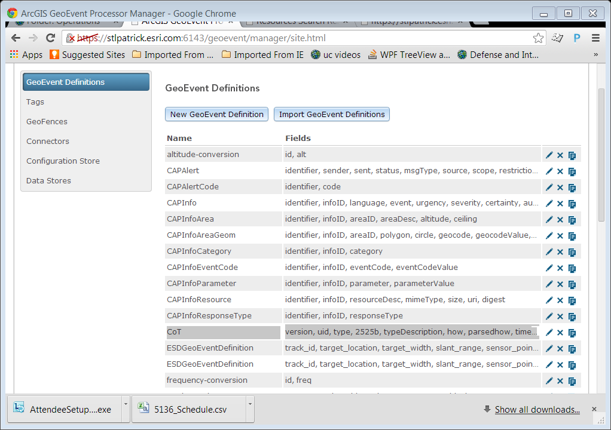
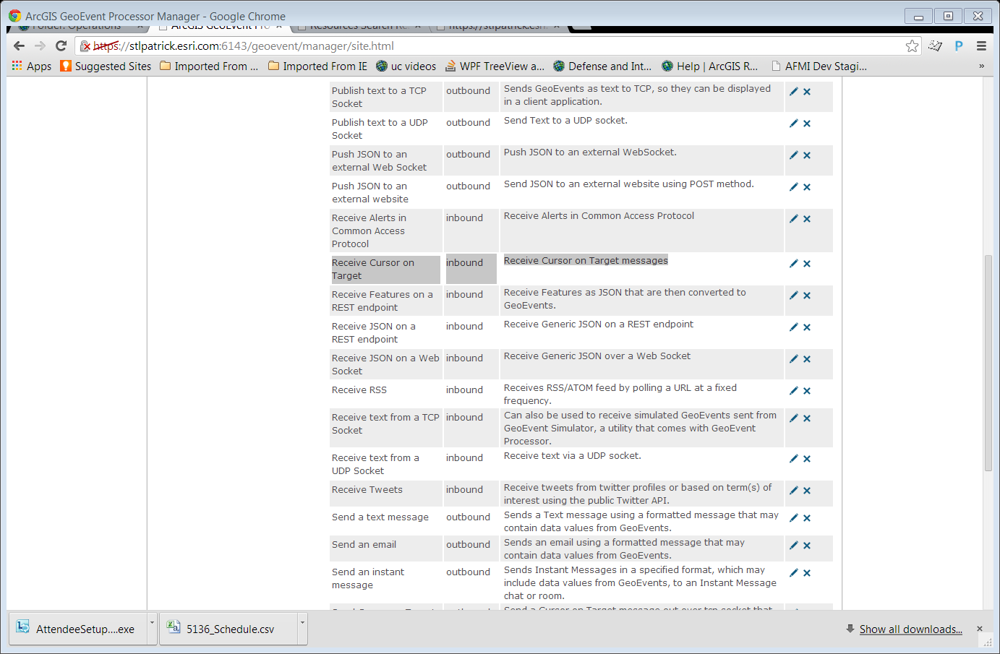
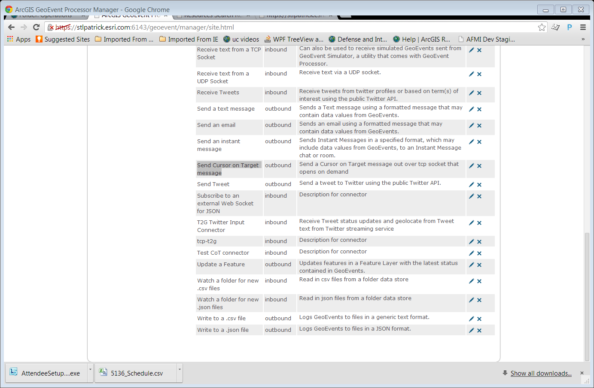
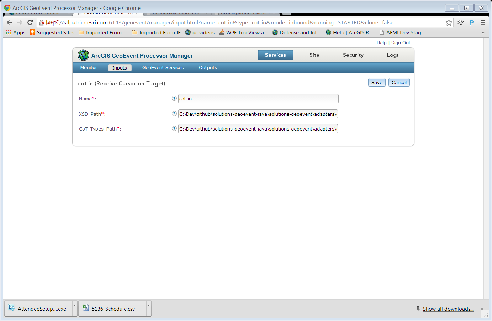
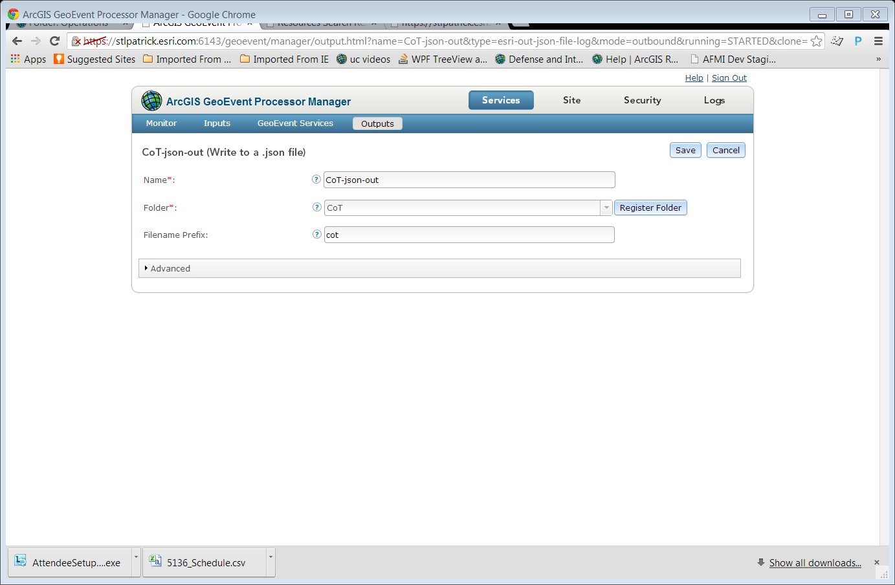
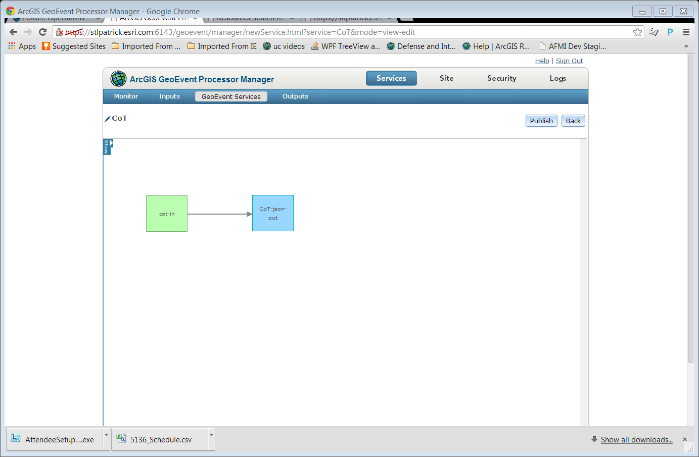
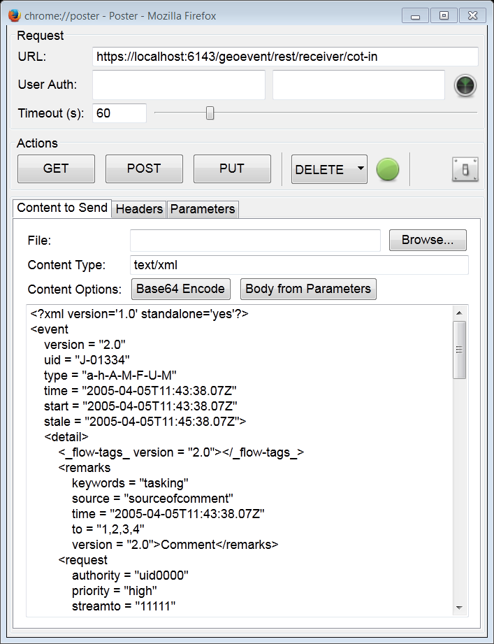
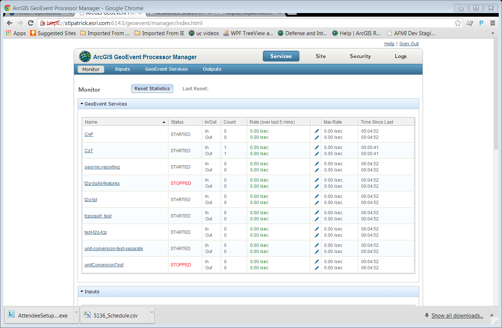

# CoT-Adapter

The CoT adapter provides an example of how to ingest Cursor on Target (CoT) messages as geoevents.

## Features

* Receives XML messages conforming to the CoT message format
* Converts message received using available GEP definitions

## Sections

* [Requirements](#requirements)
* [Building](#building)
* [Installation](#installation)
* [Testing](#testing)
* [Licensing](#licensing)

## Requirements

* See common [solutions-geoevent-java requirements](../../../README.md#requirements)
* There are no additional requirements for this project

## Building 

* See the [solutions-geoevent-java instructions](../../../README.md#instructions) for general instructions on 
    * verifying your Maven installation
    * setting the location of the GEP Server and GEP SDK repositories
    * and any other common required steps
 * Open a command prompt and navigate to `solutions-geoevent-java/solutions-geoevent/adapters/cot-adapter`
 * * Enter `mvn install` at the prompt

## Installation

* Install the adapter
    * Browse to `solutions-geoevent-java/solutions-geoevent/adapters/cot-adapter/target` (this directory is created when you execute mvn install).
    * Copy the jar file and paste it into the deploy directory on your GeoEvent server (<GEP install location>\deploy\ -- default location is C:\Program Files\ArcGIS\Server\GeoEventProcessor\deploy)

## Testing

### Validating the Installation
 
* See the [solutions-geoevent-java validation instructions](../../../README.md#validating-install).

### Testing with Simulated Test Data

* In the following steps you will configure GEP to receive and process simulated CoT data
    * Navigate to ‘Site’ > ‘GeoEvent Processor’ > 'GeoEvent Definitions'
    * Note that a GeoEvent Definition named CoT was created for you when you deployed the CoT Adapter'

    * Navigate to ‘Site’ > ‘GeoEvent Processor’ > 'Connectors'
    * Note an inbound connector to receive CoT over http has been created when you deployed the CoT Adaptor. 

    * Note an  outbound connector to send CoT over a TCP channel that opens on demand has been created when you deployed the CoT Adaptor. 

* Next use the GEP Manager and Service Designer to
    * Create an Input Service to receive CoT messages using the inbound connector created for you.
	* For the XSDPath_Path  property use the location of the CoTtypes.xml downloaded from github (<download location>/solutions-geoevent-java/solutions-geoevent/adapters/cot-adapter/src/main/resources/CoTTypes/CoTtypes.xml)
	* For the CoTTypes_Path property use the location of the CoTtypes.xml downloaded from github (<download location>/solutions-geoevent-java/solutions-geoevent/adapters/cot-adapter/src/main/resources/XSD-Add-on)

    * Create an Output service to write output to json file (Note: this is not the outbound CoT connector created when you deployed)

    * Create a simple service to direct the Input CoT over Http to an output json file

    * Use an html poster application such as Firefox Poster to send messages to the CoT service

	* In the URL textbox put the receiver endpoint of your CoT inbound service in the form of: 'https://<host machine of geoevent server>:6143/geoevent/rest/receiver/<name of inbound service>'        
	* Browse to the simulation_files folder downloaded from github (<install location>/solutions-geoevent-java\data\simulation_files)
	* Open one of the CoT simulation files (Named CoT1.xml - CoT4.xml)
	* Copy and paste the contents into the content window of FireFox Poster
	* Click on the POST button in FireFox Poster
* Navigate to ‘Services’ > ‘Monitor’. The your CoT service should register 1 input and 1 output (note: your names/outputs may differ)

* Repeat with the other simulation files if desired
## Resources

* Learn more about the Common Alerting Protocol
    * [CoT](http://cot.mitre.org/index.html)
## Licensing

Copyright 2013 Esri

Licensed under the Apache License, Version 2.0 (the "License");
you may not use this file except in compliance with the License.
You may obtain a copy of the License at

   [http://www.apache.org/licenses/LICENSE-2.0](http://www.apache.org/licenses/LICENSE-2.0)

Unless required by applicable law or agreed to in writing, software
distributed under the License is distributed on an "AS IS" BASIS,
WITHOUT WARRANTIES OR CONDITIONS OF ANY KIND, either express or implied.
See the License for the specific language governing permissions and
limitations under the License.

A copy of the license is available in the repository's
[license.txt](../../../license.txt) file.
