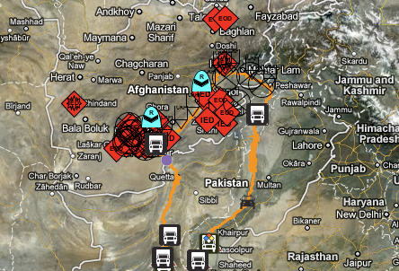
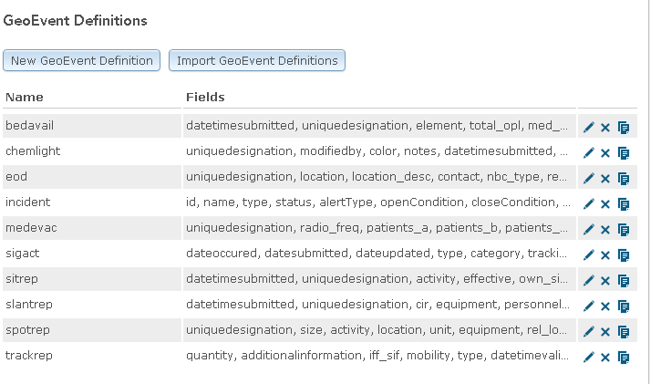
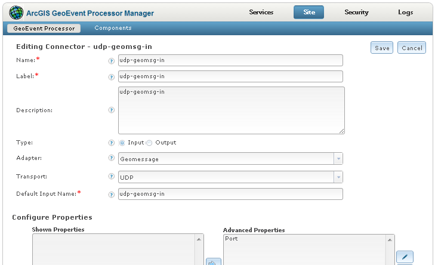
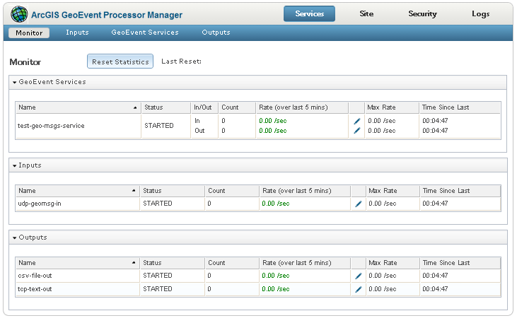

# geomessage-adapter

The geomessage-adapter provides an example of an adapter that can receive and send XML messages in a simple geomessage format.  This geomessage format is an XML format for use with [Esri military features](http://resources.arcgis.com/en/help/main/10.2/index.html#//000n0000000p000000)
 and corresponds to the format used by the [ArcGIS Runtime Message Processor](https://developers.arcgis.com/en/java/api-reference/com/esri/core/symbol/advanced/MessageProcessor.html).

## Features

* Sends and receives XML messages in a geomessage format
* Converts message types received using available GEP GeoEvent Processor definitions
* The "_type" element of the message is used to look up an existing geoevent definition
* Here are example of some of these definitions:

Definition | Purpose 
--- | ---
trackrep | Track movement reports
spotrep | To create SPOT reports
eod | To create and update EOD reports
medevac | To create Medevac reports
sitrep | To create SITREPS
slantrep | To create SLANTREPS
bedavail | To update the status of the Bedavail in an area updated based on reporting unit
chemlight | To create chemlights reports

## Sections

* [Requirements](#requirements)
* [Building](#building)
* [Installation](#installation)
* [Testing](#testing)
* [Licensing](#licensing)

## Requirements

* See common [solutions-geoevent-java requirements](../../../README.md#requirements)
* There are no additional requirements for this project

## Building 

* See the [solutions-geoevent-java instructions](../../../README.md#instructions) for general instructions on 
    * verifying your Maven installation
    * setting the location of the GEP Server and GEP SDK repositories
    * and any other common required steps
 * Open a command prompt and navigate to `solutions-geoevent-java/solutions-geoevent/adapters/geomessage-adapter`
* Enter `mvn install` at the prompt

## Installation

* Install the adapter
    * Browse to `solutions-geoevent-java/solutions-geoevent/adapters/geomessage-adapter/target` (this directory is created when you execute mvn install).
    * Copy the geomessage-adapter-{version}.jar file and paste it into the deploy directory on your GeoEvent server (<GEP install location>\deploy\ -- default location is C:\Program Files\ArcGIS\Server\GeoEventProcessor\deploy)
* Check the existing geoevent definitions
    *  Open the GeoEvent Processor Manager web application.
    *  Navigate to ‘Site’ > ‘GeoEvent Processor’ > ‘GeoEvent Definitions’ 
    *  Confirm that the following GEP geoevent definitions are available

* If these definitions are not available, do the following to install these definitions
    *  Navigate to ‘Site’ > ‘GeoEvent Processor’ > ‘Configuration Store’ and click ‘Import Configuration’
    *  Browse to `solutions-geoevent-java\data\configurations` and locate the `GeoEventDefinitions-GeoMessageAdapter.xml` configuration file. This file is located [here](../../../data/configurations/GeoEventDefinitions-GeoMessageAdapter.xml).
    *  On the GeoEvent Processor’s Import Configuration panel, click Import.

## Testing

### Validating the Installation
 
* See the [solutions-geoevent-java validation instructions](../../../README.md#validating-install).

### Testing with Live Data

* Download and build an application that can send simulated geomessages over UDP
    * A sample UDP geomessage simulation application is available with the [Vehicle Commander repository](https://github.com/Esri/vehicle-commander/tree/master/source/MessageSimulator)
    * A pre-built version of this project is included [here](../../../data/utilities/UDPGeoMessageSimulator)
    * A sample simulation file, SimpleGeoMessage.xml, is provided [here](../../../data/simulation_files)
* In the following steps you will configure GEP to receive and process simulated geomessage data
* Open the GEP Manager web application
* Create a connector to receive UDP data
    * Navigate to ‘Site’ > ‘GeoEvent Processor’ > 'Connectors'
    * Select Create Connector and configure as shown

* Next use the GEP Manager and Service Designer to
    * Create an Input to receive geomessage data using the created connector 
    * Create an Output to observe received data
    * Create a simple service to direct the Input data to the Output
    * An example of a simple service is shown below 

* Navigate to ‘Services’ > ‘Monitor’ and observe that you have a configuration similar to the following (note: your names/outputs may differ)

* Start the UDP geomessage simulator and observe that the values increase on the monitor and the selected outputs are updated.

## Licensing

Copyright 2013 Esri

Licensed under the Apache License, Version 2.0 (the "License");
you may not use this file except in compliance with the License.
You may obtain a copy of the License at

   [http://www.apache.org/licenses/LICENSE-2.0](http://www.apache.org/licenses/LICENSE-2.0)

Unless required by applicable law or agreed to in writing, software
distributed under the License is distributed on an "AS IS" BASIS,
WITHOUT WARRANTIES OR CONDITIONS OF ANY KIND, either express or implied.
See the License for the specific language governing permissions and
limitations under the License.

A copy of the license is available in the repository's
[license.txt](../../../license.txt) file.

