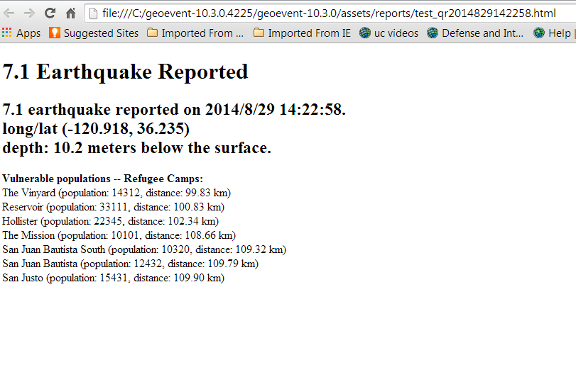
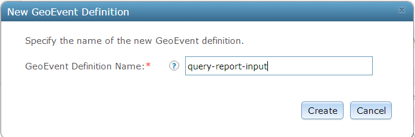
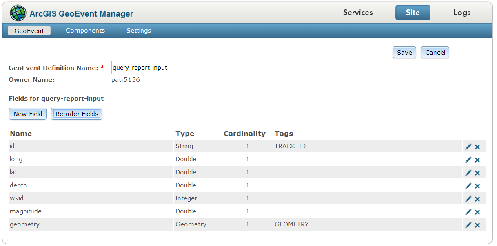
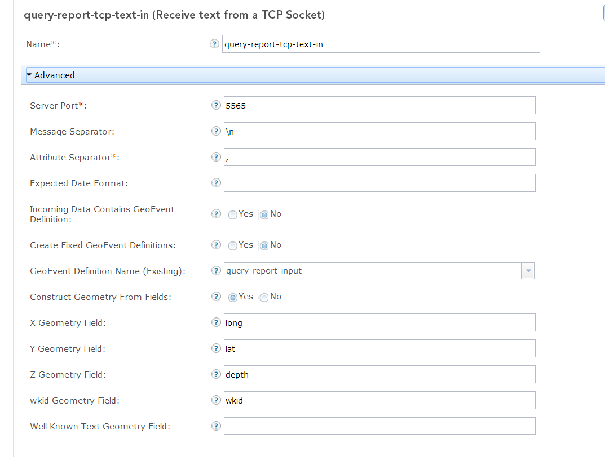
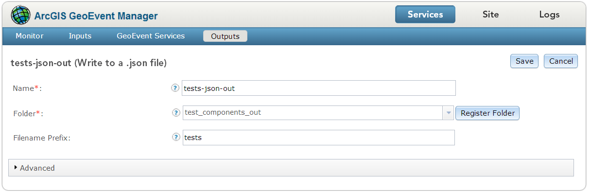
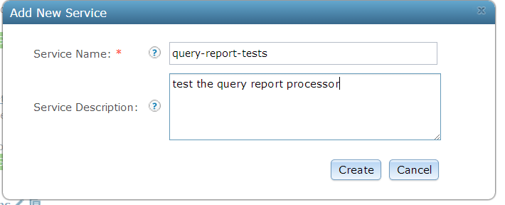
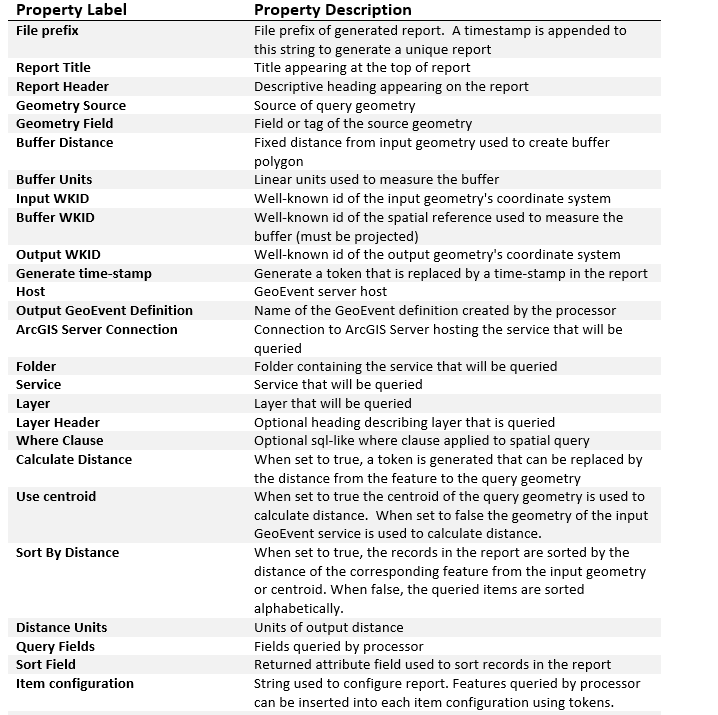
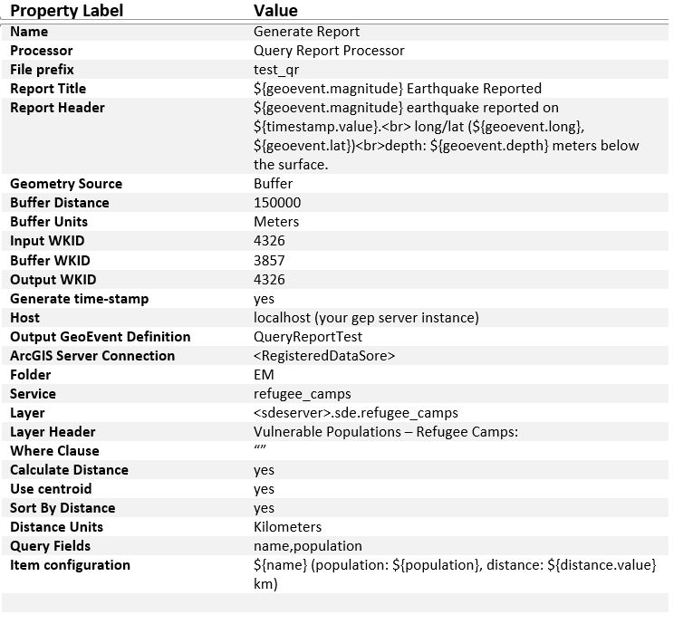
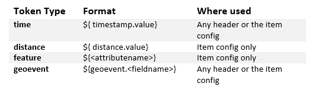
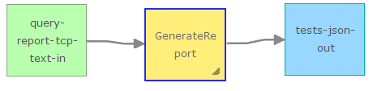

# Geometry Processors

The Geometry Processors demonstrate how to extend GeoEvent Processor to build custom processors that perform actions and processing on the geometries of a GeoEvent Service.  

## Features 

* Query Report Processor - Executes a spatial query on feature services registered in GeoEvent Processor's data store.  The author of the service can then configures a report based on returned features.

## Sections

* [Requirements](#requirements)
* [Building](#building)
* [Installation](#installation)
* [Testing](#testing)
* [Licensing](#licensing)

## Requirements

* See common [solutions-geoevent-java requirements](../../../../README.md#requirements).
* The ArcGIS Runtime for Java SDK is required in order to run the standalone Maven Tests included with this project.

## Building 

* See the [solutions-geoevent-java instructions](../../../../README.md#instructions) for general instructions on 
    * verifying your Maven installation
    * setting the location of GeoEvent Processor and GeoEvent Processor SDK repositories
    * and any other common required steps
* Open a command prompt and navigate to `solutions-geoevent-java/solutions-geoevent/processors/10.3.0/query-report-processor`
    * Enter `mvn install` at the prompt.

## Installation

* Install the Geometry Processors.
    * Browse to `solutions-geoevent-java/geoevent-solutions/processors/10.3.0/query-report-processor/target` (this directory is created when you execute mvn install).
    * Copy the .jar file and paste it into the deploy folder in the GeoEvent Processor install directory ([GeoEvent Processor install location]\deploy\ -- default location is C:\Program Files\ArcGIS\Server\GeoEventProcessor\deploy).

## Testing

### Validating the Installation
 
* See the [solutions-geoevent-java validation instructions](../../../../README.md#validating-install).
    * Ensure the Buffer, Ellipse, Range Fan, Visibility, Query Report, etc. processors exist.

### Testing with Simulated Test Data
In order to use the Query Report Processor some prerequisite steps are required.  The Query Report Processor executes a spatial query on a feature service on an [ArcGIS Server instance registered with the GeoEvent extension.](http://resources.arcgis.com/en/help/main/10.2/#/Managing_data_stores/0154000006m2000000/)  In the following steps you will create a Refugee Camps feature service that will be queried by the processor.
* Browse to `solutions-geoevent-java/data/packages` and find the refugee_camps.mpk map package.
* Double click the map package to open in ArcMap.
* The map package will pull the features into a local file geodatabase.  To publish the features in a feature service the feature class must be in an sde geodatabase.  Use the export features tool to export the features into an sde geodatabase.
* Next modify the paths to the feature data of the refugee camps to point to the sde feature class you just created.
* Click save to save changes in the map document.
* Next follow the instructions (here) to publish the refugee camps map document as a feature service.

* In the following steps you will configure GeoEvent Processor to receive and process simulated data.
* The following example configures the <PROCESSORNAME>, the other processors can be configured in a similar manner.

* Open GeoEvent Processor Manager.
* Create a new GeoEvent definition 
   * Go to Site > GeoEvent > GeoEvent Definitions
   * Click 'New GeoEvent Definition'
   * In the the New Geoevent Definition dialog configure similar to the follwing illustration

in the GeoEvent Definition Name textbox and click 'Create'
   * Configure the fields as in the image below (this will ensure that the sample simulation data can be consumed in the test service).
   

* Create an Input Service to accept text over tcp messages
   * In GeoEvent Manager go to Services->Input and click Add Input
   * In the Input Connectors Window choose 'Receive text from a TCP socket'
   * Configure the service similar to the picture below.

* Next, create an Output Connector to observe the received data.
    * Navigate ‘Services’ > 'Outputs'.
    * Select Add Output and select 'Write to a json file' and configure the properties using the image below as a guide.
    

   * If you do not have a registered folder already to write json files to, click the 'Register Folder' button and give the folder a name and point it to an existing folder on your file system. In the example the name is test_components_out and the path is C:\gep\registered\tests.  
   * Click 'Save' when you are finished.
* Create a simple GeoEvent Service to direct the input data to the output using the selected processor.
   * Go to Services > GeoEvent Services and click 'Add Service'
   * In the Add New Service dialog enter a name and description similar to the following

   * On the left panel click and drag the input service you created previously and tests-json-output services into the service constructor window.
   * Next click and drag a Processor into the service constructor window.
   * Use the following illustration as a guide to the configurable properties supported in the Query Report Processor

   * Configure the processor similar to the illustration below.
   

   
   *The Query Report Processor uses tokens as place holders that are replaced with feature data extracted from the query response, values from the geoevent, a timesamp optionally generated by the processor and/or a distance calculated between the event geometry and each returned feature. Use the following illustration as a guide to the supported format of tokens.

   * Connect the components of the service as illustrated below.

* When finished click the 'Publish' button to save the service.

* In GeoEvent Processor Manager, navigate to ‘Services’ > ‘Monitor’ and observe the GeoEvent Processor components. You should see the newly created service and it should have a status of 'Started'.

* Using the GeoEvent Simulator, load the simulation file located at  solutions-geoevent-java\data\simulation_files\<SIMULATION>.csv
* Set the listening server to your geoevent server instance (local host if the simulator is on the same machine as geoevent server)
* Set the port to the same value as you set the input services port and click the connect button
* Click the 'Play' button to run the simulation
* In GeoEvent Processor Manager, navigate to 'Services' > 'Monitor' to observe that the values are increasing and the selected outputs are updated. 
* Next go to Services > Output and find the tests-json-out service you created previosly
* Click the Stop button to stop the service
* In a file browser go to the folder where your tests-json-output is located.
* Open the tests_<timestamp>.json file with the most recent timestamp.
* You should see a url field that has been attached to the output geoevent.  This url is an http page uploaded to the local geoevent web server.  Copy and paste this url into a browser. You should see a report similar to the following.

* You can now test the processors with additional outputs such as published feature services.

## Licensing

Copyright 2013 Esri

Licensed under the Apache License, Version 2.0 (the "License");
you may not use this file except in compliance with the License.
You may obtain a copy of the License at

   [http://www.apache.org/licenses/LICENSE-2.0](http://www.apache.org/licenses/LICENSE-2.0)

Unless required by applicable law or agreed to in writing, software
distributed under the License is distributed on an "AS IS" BASIS,
WITHOUT WARRANTIES OR CONDITIONS OF ANY KIND, either express or implied.
See the License for the specific language governing permissions and
limitations under the License.

A copy of the license is available in the repository's
[license.txt](../../../license.txt) file.
