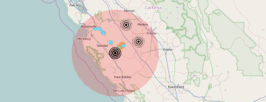

# Spatial Query

The Spatial Query Processor executes a spatial query on a feature service's rest endpoint. The query area is generated from either a buffer centering on the incoming event's geometry or on the event geometry if it has a geometry type of polygon. Each feature returned in the query is converted into a new geoevent with attribute values from the queried feature and the incoming event. 

## Sections

* [Requirements](#requirements)
* [Building](#building)
* [Installation](#installation)
* [Testing](#testing)
* [Licensing](#licensing)

## Requirements

* See common [solutions-geoevent-java requirements](../../../README.md#requirements).
* The ArcGIS Runtime for Java SDK is required in order to run the standalone Maven Tests included with this project.

## Building 

* See the [solutions-geoevent-java instructions](../../../README.md#instructions) for general instructions on 
    * verifying your Maven installation
    * setting the location of GeoEvent Processor and GeoEvent Processor SDK repositories
    * and any other common required steps
* Open a command prompt and navigate to `solutions-geoevent-java/solutions-geoevent/10.3.0/processors/spatialquery-processor`
    * Enter `mvn install` at the prompt.

## Installation

* Install the Spatial Query Processor.
    * Browse to `solutions-geoevent-java/solutions-geoevent/processors/10.3.0/spatialquery-processor/target` (this directory is created when you execute mvn install).
    * Copy the .jar file and paste it into the deploy folder in the GeoEvent Processor install directory ([GeoEvent Processor install location]\deploy\ -- default location is C:\Program Files\ArcGIS\Server\GeoEventProcessor\deploy).

## Testing

### Validating the Installation
 
* See the [solutions-geoevent-java validation instructions](../../../README.md#validating-install).
    * Ensure the Spatial Query Processor exists.

### Testing with Simulated Test Data

#### Deploying the Test Configuration

If you have already deployed the test configuration you may move on to Testing the Component

In GeoEvent Extension Manager 

* Go to the Site >> Configuration Store Tab. 
* Click the 'Import Configuration' button. 
* Select 'Choose File'
* Browse to the ./solutions-geoevent-java/data/configurations/ directory 
* Select the SolutionsComponentTestConfig.xml 
* Click 'Open' in the dialog. 
* Click 'Next'. 
* When prompted choose 'Import Configuration'. 

The test service configuration will be deployed to your instance of GeoEvent.

#### Testing the Component

The Introduction to GeoEvent tutorial has a simple TCP-Console application that will be used for most of the tests. It can be found [here](http://www.arcgis.com/home/item.html?id=b6a35042effd44ceab3976941d36efcf).

You will use the SpatialQuery-Test service from the Solutions Test Configuration to test the functionality of the Spatial Query Processor.
* This simulation requires the refugee_camps service be published to your default datastore. Make adjustments as needed to query another service or if the refugee_cams service is published to a different ArcGIS Server instance. A map package containing the layers for this service can be found [here](https://github.com/Esri/solutions-geoevent-java/blob/master/data/packages/refugee_camps.mpk?raw=true)
* Open the SpatialQuery-Test service in GEE Manager. 
* Click on the spatial-query-tcp-txt-in Input and expand the 'Advanced' tab. Note that the input uses TCP port 5612.
* Open the ArcGIS GeoEvent Simulator (this is installed with GeoEvent Extension and can be found at the GeoEvent Extension install location).
* Make sure the Server points to the server on which GeoEvent Extension is deployed (default is local host).
* In the upper right, change the port to 5612 and  click the button with the red X to connect (Note: if you cannot connect the server is not listening on that port. This may be because the Input in GeoEvent extension has not been started).
* Make sure 'File' is selected in the combo box on the upper left.
* Click the 'Load File' button in the upper right.
* In the new dialog, click the file folder button in the upper right.
* Browse to the ./solutions-geoevent-java/data/simulation-files/ directory.
* Select queryreport.csv and click 'Open' (note the same simulation file is used for both query report processoer and spatial query processor).
* Click the 'Load' button. In the Preview Edits window you will see 1 record.
* Browse to the directory of the TCP-Console application (if you downloaded it from the tutorial it will be at ./IntroductionToGeoEvent/utilities/tcp-server-app).
* Double click TCPServerApp.bat (the application will not start if no services are listening on port 5570 - if you have deployed the test configuration an output service has been configured to listen on this port. Check that the Output tcp-out-5570 has been deployed and started).
* In the GeoEvent Simulator click the 'Step' button.
* In the TCP-console you will see that the Received Event (Event Definition name) is sqtest with a comma separated list of values. If using the refugee_camps service a total of 5 events will be generated by the processor - one for each feature returned by the spatial query.

## Licensing

Copyright 2014 Esri

Licensed under the Apache License, Version 2.0 (the "License");
you may not use this file except in compliance with the License.
You may obtain a copy of the License at

   [http://www.apache.org/licenses/LICENSE-2.0](http://www.apache.org/licenses/LICENSE-2.0)

Unless required by applicable law or agreed to in writing, software
distributed under the License is distributed on an "AS IS" BASIS,
WITHOUT WARRANTIES OR CONDITIONS OF ANY KIND, either express or implied.
See the License for the specific language governing permissions and
limitations under the License.

A copy of the license is available in the repository's
[license.txt](../../../license.txt) file.

solutions-geoevent-java 
====================

The solutions-geoevent-java repository includes custom connectors for use with [ArcGIS GeoEvent Processor for Server](http://www.esri.com/software/arcgis/arcgisserver/extensions/geoevent-extension). 

## Features

Adapters
* [Common Alert Protocol (CAP) Adapter](solutions-geoevent/adapters/CAP-adapter/README.md)
* [CoT Adapter](solutions-geoevent/adapters/cot-adapter/README.md)
* [Exploitation Support Data (ESD) Adapter](solutions-geoevent/adapters/esd-adapter/README.md)
* [Geomessage Adapter](solutions-geoevent/adapters/geomessage-adapter/README.md)
* [regex Text Adapter](solutions-geoevent/adapters/regexText-adapter/README.md)

Processors
* [Add XYZ Processor](solutions-geoevent/processors/addxyz-processor/README.md)
* [Bearing Processor](solutions-geoevent/processors/bearing-processor/README.md)
* [Buffer Processor](solutions-geoevent/processors/buffer-processor/README.md)
* [Ellipse Processor](solutions-geoevent/processors/ellipse-processor/README.md)
* [Event Volume Control Processor](solutions-geoevent/processors/eventVolumeControl-processor/README.md)
* [Field Grouper Processor](solutions-geoevent/processors/fieldgrouper-processor/README.md)
* [Query Report Processor](solutions-geoevent/processors/query-report-processor/README.md)
* [Range Fan Processor](solutions-geoevent/processors/rangefan-processor/README.md)
* [Symbol Lookup Processor](solutions-geoevent/processors/symbol-lookup-processor/README.md)
* [unitConverter Processor](solutions-geoevent/processors/unitConversion-processor/README.md)
* [Update Only Processor](solutions-geoevent/processors/updateOnly-processor/README.md)
* [Visibility Processor](solutions-geoevent/processors/visibility-processor/README.md)

Transports
* [IRC Transport](solutions-geoevent/transports/irc-transport/README.md)
* [TCP Squirt Transport](solutions-geoevent/transports/tcpSquirt-transport/README.md)

## Sections

* [Requirements](#requirements)
* [Instructions](#instructions)
* [Resources](#resources)
* [Issues](#issues)
* [Contributing](#contributing)
* [Licensing](#licensing)

## Requirements

* ArcGIS GeoEvent Processor (GEP) for Server
* ArcGIS Geoevent Server Software Development Kit (SDK) - the SDK is included with the Geoevent Server installation
* Java Development Kit (JDK) 1.6 or greater
* [Apache Maven](http://maven.apache.org) (you may follow the GES SDK documentation to learn how to set up a Maven repository)
* Notes on individual projects
    * Individual projects may have additional requirements. See the Readme for [each project](#features) for more information.
    * Some project have a dependency on the ArcGIS Runtime for Java SDK in order to run standalone Maven Tests. See the Readme for [each project](#features) for more information.

## Instructions

### General Help

* [New to Github? Get started here.](http://htmlpreview.github.com/?https://github.com/Esri/esri.github.com/blob/master/help/esri-getting-to-know-github.html)

### Building All Adapters and Processors
 
* Verify that Maven is installed and working correctly
    * From a command prompt, type `mvn -version` and verify that it returns the version correctly
    * If the Maven version is not returned correctly, consult the GEP SDK Developer Guide for more information on how to set up Maven. 
* Make any necessary changes to the pom.xml files to reflect the location of the GEP Server and GEP SDK repositories
    * If necessary, change the locations for the repository entries in the pom.xml 
    * The current settings assume these will be located at 
        * /Program Files/ArcGIS/Server/GeoEventProcessor/sdk/repository
        * /Program Files/ArcGIS/Server/GeoEventProcessor/system
* Depending on the version of software you have installed, you may also need to change the version property in the pom.xml files
* From a command prompt go to the `./solutions-geoevent-java/solutions-geoevent` directory
* Type `mvn install` at the prompt and hit return
* Each installed module will now have a target folder (see each module's Readme.md for the exact path)
* Browse to each target directory 
* Copy the .jar file from the target folder and paste it into the deploy directory on your GEP installation (ex. <GEP install location>\deploy\ -- default location is C:\Program Files\ArcGIS\Server\GeoEventProcessor\deploy)
 
### Validating Install
 
* Open the GeoEvent Processor Manager 
* Navigate to 'Site' > 'Components' >  'Adapters'
    *  You should see each newly installed adapter as one of the available adapters
* Navigate to 'Site' > 'Components' >  'Processors' 
    * You should see each newly installed processor as one of the available processors

## Resources

* Learn more about Esri's [ArcGIS GeoEvent Processor for Server Resource Center](http://pro.arcgis.com/share/geoevent-processor/)
* Learn more about [Extending ArcGIS GeoEvent Processor](http://resources.arcgis.com/en/help/main/10.2/index.html#//015400000664000000)
* Learn more about Esri's [ArcGIS for the Military](http://solutions.arcgis.com/military/)

## Issues

Find a bug or want to request a new feature?  Please let us know by submitting an issue.

## Contributing

Esri welcomes contributions from anyone and everyone. Please see our [guidelines for contributing](https://github.com/esri/contributing).

## Licensing

Copyright 2013 Esri

Licensed under the Apache License, Version 2.0 (the "License");
you may not use this file except in compliance with the License.
You may obtain a copy of the License at

   [http://www.apache.org/licenses/LICENSE-2.0](http://www.apache.org/licenses/LICENSE-2.0)

Unless required by applicable law or agreed to in writing, software
distributed under the License is distributed on an "AS IS" BASIS,
WITHOUT WARRANTIES OR CONDITIONS OF ANY KIND, either express or implied.
See the License for the specific language governing permissions and
limitations under the License.

A copy of the license is available in the repository's
[license.txt](license.txt) file.

